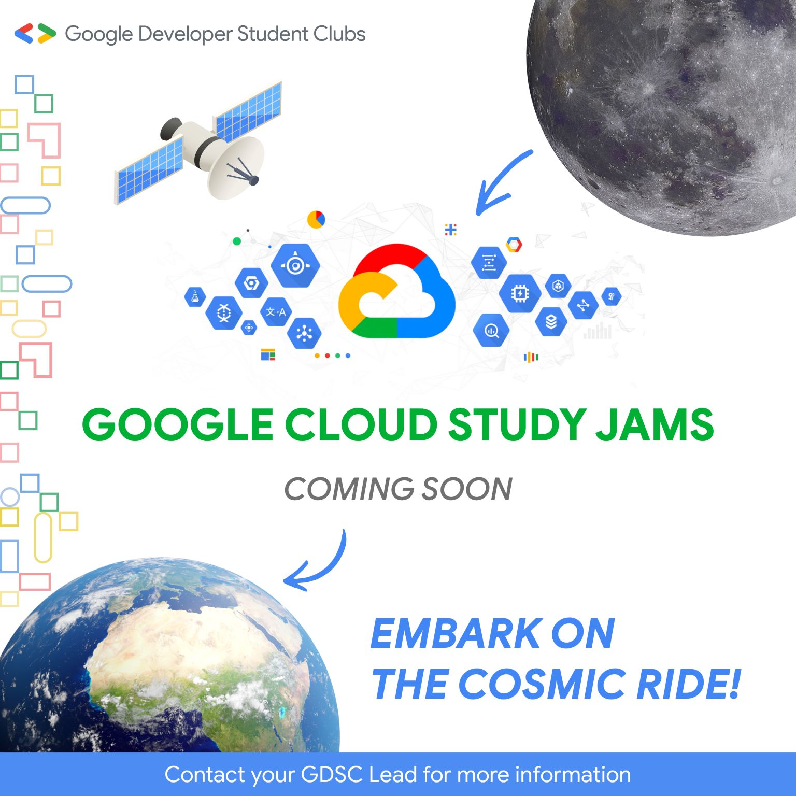

<h1 id="gccf-pathway">Gen-AI Arcade Labs</h1>
<table>
<thead>
<tr>
<th>Course Name</th>
<th>Lab Name</th>
<th>Lab Code</th>
<th>Solution Link</th>
</tr>
</thead>
<tbody>

<tr>
<td>Gel with Gen AI!</td>
<td><a href="https://www.cloudskillsboost.google/games/4422/labs/28603">APIs Explorer: Qwik Start</a></td>
<td>GSP277</td>
<td><a href="https://www.youtube.com/watch?v=FO-g3bNDygQ">Click here</a></td>
</tr>

<tr>
<td>Gel with Gen AI!</td>
<td><a href="https://www.cloudskillsboost.google/games/4422/labs/28604">Extract, Analyze, and Translate Text from Images with the Cloud ML APIs</a></td>
<td>GSP075</td>
<td><a href="https://www.youtube.com/watch?v=FO-g3bNDygQ">Click here</a></td>
</tr>

<tr>
<td>Gel with Gen AI!</td>
<td><a href="https://www.cloudskillsboost.google/games/4422/labs/28605">Analyze Images with the Cloud Vision API: Challenge Lab</a></td>
<td>ARC122</td>
<td><a href="https://www.youtube.com/watch?v=FO-g3bNDygQ">Click here</a></td>
</tr>

<tr>
<td>Gel with Gen AI!</td>
<td><a href="https://www.cloudskillsboost.google/games/4422/labs/28606">Detect Labels, Faces, and Landmarks in Images with the Cloud Vision API</a></td>
<td>GSP037</td>
<td><a href="https://www.youtube.com/watch?v=FO-g3bNDygQ">Click here</a></td>
</tr>

<tr>
<td>Gel with Gen AI!</td>
<td><a href="https://www.cloudskillsboost.google/games/4422/labs/28607">Entity and Sentiment Analysis with the Natural Language API</a></td>
<td>GSP038</td>
<td><a href="https://www.youtube.com/watch?v=FO-g3bNDygQ">Click here</a></td>
</tr>

<tr>
<td>Gel with Gen AI!</td>
<td><a href="https://www.cloudskillsboost.google/games/4422/labs/28608">Generative AI with Vertex AI: Prompt Design</a></td>
<td>GSP1151</td>
<td><a href="https://www.youtube.com/watch?v=FO-g3bNDygQ">Click here</a></td>
</tr>

<tr>
<td>Gel with Gen AI!</td>
<td><a href="https://www.cloudskillsboost.google/games/4422/labs/28609">Generative AI with Vertex AI: Getting Started</a></td>
<td>GSP1150</td>
<td><a href="https://www.youtube.com/watch?v=FO-g3bNDygQ">Click here</a></td>
</tr>

<tr>
<td>Gel with Gen AI!</td>
<td><a href="https://www.cloudskillsboost.google/games/4422/labs/28610">Get Started with Generative AI Studio</a></td>
<td>GSP1154</td>
<td><a href="https://www.youtube.com/watch?v=FO-g3bNDygQ">Click here</a></td>
</tr>

<tr>
<td>Gel with Gen AI!</td>
<td><a href="https://www.cloudskillsboost.google/games/4422/labs/28611">Vertex AI PaLM API: Qwik Start</a></td>
<td>GSP1155</td>
<td><a href="https://www.youtube.com/watch?v=FO-g3bNDygQ">Click here</a></td>
</tr>

<tr>

</tbody>
</table>

<h1 id="gccf-pathway-labs">GCCF Pathway Labs</h1>
<table>
<thead>
<tr>
<th>Quest Name</th>
<th>Lab Name</th>
<th>Lab Code</th>
<th>Solution</th>
</tr>
</thead>
<tbody>
<tr>
<td>Google Cloud Computing Foundations: Cloud Computing Fundamentals</td>
<td><a href="https://www.cloudskillsboost.google/course_sessions/4750861/labs/376187">A Tour of Google Cloud Hands-on Labs</a></td>
<td>GSP282</td>
<td><a href="https://www.youtube.com/watch?v=FO-g3bNDygQ">Click here</a></td>
</tr>

<tr>
<td>Google Cloud Computing Foundations: Cloud Computing Fundamentals</td>
<td><a href="https://www.cloudskillsboost.google/course_sessions/4750861/labs/376189">Getting Started with Cloud Shell and gcloud</a></td>
<td>GSP002</td>
<td><a href="https://www.youtube.com/watch?v=bMVBLE4dJRk">Click here</a></td>
</tr>

<tr>
<td>Google Cloud Computing Foundations: Cloud Computing Fundamentals</td>
<td><a href="https://www.cloudskillsboost.google/course_sessions/4750861/labs/376198">Creating a Virtual Machine</a></td>
<td>GSP001</td>
<td><a href="https://www.youtube.com/watch?v=Co34im5mgGA">Click here</a></td>
</tr>

<tr>
<td>Google Cloud Computing Foundations: Cloud Computing Fundamentals</td>
<td><a href="https://www.cloudskillsboost.google/course_sessions/4750861/labs/376202">App Engine: Qwik Start - Python</a></td>
<td>GSP067</td>
<td><a href="https://www.youtube.com/watch?v=Co34im5mgGA">Click here</a></td>
</tr>

<tr>
<td>Google Cloud Computing Foundations: Cloud Computing Fundamentals</td>
<td><a href="https://www.cloudskillsboost.google/course_sessions/4750861/labs/376205">Cloud Functions: Qwik Start - Command Line</a></td>
<td>GSP080</td>
<td><a href="https://www.youtube.com/watch?v=Ws_g8yCcbAk">Click here</a></td>
</tr>

<tr>
<td>Google Cloud Computing Foundations: Cloud Computing Fundamentals</td>
<td><a href="https://www.cloudskillsboost.google/course_sessions/4750861/labs/376208">Kubernetes Engine: Qwik Start</a></td>
<td>GSP100</td>
<td><a href="https://www.youtube.com/watch?v=W15XgGTfHCQ">Click here</a></td>
</tr>

<!--
Quest 1 labs completed.
!-->

<tr>
<td>Google Cloud Computing Foundations: Infrastructure in Google Cloud</td>
<td><a href="https://www.cloudskillsboost.google/course_sessions/4851657/labs/377256">Cloud Storage: Qwik Start - CLI/SDK</a></td>
<td>GSP074</td>
<td><a href="https://www.youtube.com/watch?v=KssbHsCGcYk">Click here</a></td>
</tr>

<tr>
<td>Google Cloud Computing Foundations: Infrastructure in Google Cloud</td>
<td><a href="https://www.cloudskillsboost.google/course_sessions/4851657/labs/377260">Cloud SQL for MySQL: Qwik Start</a></td>
<td>GSP151</td>
<td><a href="https://www.youtube.com/watch?v=KssbHsCGcYk">Click here</a></td>
</tr>

<tr>
<td>Google Cloud Computing Foundations: Infrastructure in Google Cloud</td>
<td><a href="https://www.cloudskillsboost.google/course_sessions/4851657/labs/377271">Cloud Endpoints: Qwik Start</a></td>
<td>GSP164</td>
<td><a href="https://www.youtube.com/watch?v=KssbHsCGcYk">Click here</a></td>
</tr>

<tr>
<td>Google Cloud Computing Foundations: Infrastructure in Google Cloud</td>
<td><a href="https://www.cloudskillsboost.google/course_sessions/4851657/labs/377275">Google Cloud Pub/Sub: Qwik Start - Python</a></td>
<td>GSP094</td>
<td><a href="https://www.youtube.com/watch?v=KssbHsCGcYk">Click here</a></td>
</tr>

<tr>
<td>Google Cloud Computing Foundations: Infrastructure in Google Cloud</td>
<td><a href="https://www.cloudskillsboost.google/course_sessions/4851657/labs/377284">User Authentication: Identity-Aware Proxy</a></td>
<td>GSP499</td>
<td><a href="https://www.youtube.com/watch?v=KssbHsCGcYk">Click here</a></td>
</tr>

<tr>
<td>Google Cloud Computing Foundations: Infrastructure in Google Cloud</td>
<td><a href="https://www.cloudskillsboost.google/course_sessions/4851657/labs/377287">Cloud IAM: Qwik Start</a></td>
<td>GSP064</td>
<td><a href="https://www.youtube.com/watch?v=jbW70MdoeXI">Click here</a></td>
</tr>

<!--
Quest 2 labs completed.
!-->

<tr>
<td>Google Cloud Computing Foundations: Networking & Security in Google Cloud</td>
<td><a href="https://www.cloudskillsboost.google/course_sessions/4881650/labs/377208">Multiple VPC Networks</a></td>
<td>GSP211</td>
<td><a href="https://www.youtube.com/watch?v=jbW70MdoeXI">Click here</a></td>
</tr>

<tr>
<td>Google Cloud Computing Foundations: Networking & Security in Google Cloud</td>
<td><a href="https://www.cloudskillsboost.google/course_sessions/4881650/labs/377208">VPC Networks - Controlling Access</a></td>
<td>GSP213</td>
<td><a href="https://www.youtube.com/watch?v=jbW70MdoeXI">Click here</a></td>
</tr>

<tr>
<td>Google Cloud Computing Foundations: Networking & Security in Google Cloud</td>
<td><a href="https://www.cloudskillsboost.google/course_sessions/4881650/labs/377208">HTTP Load Balancer with Cloud Armor</a></td>
<td>GSP215</td>
<td><a href="https://www.youtube.com/watch?v=jbW70MdoeXI">Click here</a></td>
</tr>

<tr>
<td>Google Cloud Computing Foundations: Networking & Security in Google Cloud</td>
<td><a href="https://www.cloudskillsboost.google/course_sessions/4881650/labs/377223">Cloud Monitoring: Qwik Start</a></td>
<td>GSP089</td>
<td><a href="https://www.youtube.com/watch?v=tx8I0N6F40E">Click here</a></td>
</tr>

<!--
Quest 3 labs completed.
!-->

<tr>
<td>Google Cloud Computing Foundations: Data, ML, and AI in Google Cloud</td>
<td><a href="https://www.cloudskillsboost.google/course_sessions/4920324/labs/377368">Dataproc: Qwik Start - Console</a></td>
<td>GSP103</td>
<td><a href="https://www.youtube.com/watch?v=tx8I0N6F40E">Click here</a></td>
</tr>

<tr>
<td>Google Cloud Computing Foundations: Data, ML, and AI in Google Cloud</td>
<td><a href="https://www.cloudskillsboost.google/course_sessions/4920324/labs/377370">Dataproc: Qwik Start - Command Line</a></td>
<td>GSP104</td>
<td><a href="https://www.youtube.com/watch?v=tx8I0N6F40E">Click here</a></td>
</tr>

<tr>
<td>Google Cloud Computing Foundations: Data, ML, and AI in Google Cloud</td>
<td><a href="https://www.cloudskillsboost.google/course_sessions/4920324/labs/377373">Dataflow: Qwik Start - Templates</a></td>
<td>GSP192</td>
<td><a href="https://www.youtube.com/watch?v=tx8I0N6F40E">Click here</a></td>
</tr>

<tr>
<td>Google Cloud Computing Foundations: Data, ML, and AI in Google Cloud</td>
<td><a href="https://www.cloudskillsboost.google/course_sessions/4920324/labs/377375">Dataflow: Qwik Start - Python</a></td>
<td>GSP207</td>
<td><a href="https://www.youtube.com/watch?v=tx8I0N6F40E">Click here</a></td>
</tr>

<tr>
<td>Google Cloud Computing Foundations: Data, ML, and AI in Google Cloud</td>
<td><a href="https://www.cloudskillsboost.google/course_sessions/4920324/labs/377378">Dataprep: Qwik Start</a></td>
<td>GSP105</td>
<td><a href="https://www.youtube.com/watch?v=tx8I0N6F40E">Click here</a></td>
</tr>

<tr>
<td>Google Cloud Computing Foundations: Data, ML, and AI in Google Cloud</td>
<td><a href="https://www.cloudskillsboost.google/course_sessions/4920324/labs/377385">Vertex AI: Qwik Start</a></td>
<td>GSP917</td>
<td><a href="https://www.youtube.com/watch?v=tx8I0N6F40E">Click here</a></td>
</tr>

<tr>
<td>Google Cloud Computing Foundations: Data, ML, and AI in Google Cloud</td>
<td><a href="https://www.cloudskillsboost.google/course_sessions/4920324/labs/377390">Cloud Natural Language API: Qwik Start</a></td>
<td>GSP097</td>
<td><a href="https://www.youtube.com/watch?v=tx8I0N6F40E">Click here</a></td>
</tr>

<tr>
<td>Google Cloud Computing Foundations: Data, ML, and AI in Google Cloud</td>
<td><a href="https://www.cloudskillsboost.google/course_sessions/4920324/labs/377392">Google Cloud Speech API: Qwik Start</a></td>
<td>GSP119</td>
<td><a href="https://www.youtube.com/watch?v=tx8I0N6F40E">Click here</a></td>
</tr>

<tr>
<td>Google Cloud Computing Foundations: Data, ML, and AI in Google Cloud</td>
<td><a href="https://www.cloudskillsboost.google/course_sessions/4920324/labs/377394">Video Intelligence: Qwik Start</a></td>
<td>GSP154</td>
<td><a href="https://www.youtube.com/watch?v=tx8I0N6F40E">Click here</a></td>
</tr>

<!--
Quest 4 labs completed.
!-->

<tr>
<td>Create and Manage Cloud Resources</td>
<td><a href="https://www.cloudskillsboost.google/course_sessions/4750861/labs/376187">A Tour of Google Cloud Hands-on Labs</a></td>
<td>GSP282</td>
<td><a href="https://www.youtube.com/watch?v=FO-g3bNDygQ">Click here</a></td>
</tr>

<tr>
<td>Create and Manage Cloud Resources</td>
<td><a href="https://www.cloudskillsboost.google/course_sessions/4750861/labs/376198">Creating a Virtual Machine</a></td>
<td>GSP001</td>
<td><a href="https://www.youtube.com/watch?v=Co34im5mgGA">Click here</a></td>
</tr>

<tr>
<td>Create and Manage Cloud Resources</td>
<td><a href="https://www.cloudskillsboost.google/course_sessions/4750861/labs/376189">Getting Started with Cloud Shell and gcloud</a></td>
<td>GSP002</td>
<td><a href="https://www.youtube.com/watch?v=bMVBLE4dJRk">Click here</a></td>
</tr>

<tr>
<td>Create and Manage Cloud Resources</td>
<td><a href="https://www.cloudskillsboost.google/course_sessions/4750861/labs/376208">Kubernetes Engine: Qwik Start</a></td>
<td>GSP100</td>
<td><a href="https://www.youtube.com/watch?v=W15XgGTfHCQ">Click here</a></td>
</tr>

<td>Create and Manage Cloud Resources</td>
<td><a href="https://www.cloudskillsboost.google/course_sessions/4880158/labs/404036">Set Up Network and HTTP Load Balancers</a></td>
<td>GSP007</td>
<td><a href="https://www.youtube.com/watch?v=dqXzfAZFJeE">Click here</a></td>
</tr>

<tr>
<td>Create and Manage Cloud Resources</td>
<td><a href="https://www.cloudskillsboost.google/course_sessions/4880158/labs/404037">Create and Manage Cloud Resources: Challenge Lab</a></td>
<td>GSP313</td>
<td><a href="https://www.youtube.com/watch?v=2pNTwtxGsF8">Click here</a></td>
</tr>

<!--
Quest 5 labs completed.
!-->

<tr>
<td>Perform Foundational Infrastructure Tasks in Google Cloud</td>
<td><a href="https://www.cloudskillsboost.google/focuses/569?parent=catalog">Cloud Storage: Qwik Start - CLI/SDK</a></td>
<td>GSP074</td>
<td><a href="https://www.youtube.com/watch?v=KssbHsCGcYk">Click here</a></td>
</tr>

<tr>
<td>Perform Foundational Infrastructure Tasks in Google Cloud</td>
<td><a href="https://www.cloudskillsboost.google/focuses/44159?parent=catalog">Cloud IAM: Qwik Start</a></td>
<td>GSP064</td>
<td><a href="https://www.youtube.com/watch?v=jbW70MdoeXI">Click here</a></td>
</tr>

<tr>
<td>Perform Foundational Infrastructure Tasks in Google Cloud</td>
<td><a href="https://www.cloudskillsboost.google/focuses/10599?parent=catalog">Cloud Monitoring: Qwik Start</a></td>
<td>GSP089</td>
<td><a href="https://www.youtube.com/watch?v=tx8I0N6F40E">Click here</a></td>
</tr>

<tr>
<td>Perform Foundational Infrastructure Tasks in Google Cloud</td>
<td><a href="https://www.cloudskillsboost.google/focuses/916?parent=catalog">Cloud Functions: Qwik Start - Command Line</a></td>
<td>GSP080</td>
<td><a href="https://www.youtube.com/watch?v=Ws_g8yCcbAk">Click here</a></td>
</tr>

<tr>
<td>Perform Foundational Infrastructure Tasks in Google Cloud</td>
<td><a href="https://www.cloudskillsboost.google/focuses/925?parent=catalog">Google Cloud Pub/Sub: Qwik Start - Command Line</a></td>
<td>GSP095</td>
<td><a href="https://www.youtube.com/watch?v=preHAbiidGM">Click here</a></td>
</tr>

<tr>
<td>Perform Foundational Infrastructure Tasks in Google Cloud</td>
<td><a href="https://www.cloudskillsboost.google/focuses/10379?parent=catalog">Perform Foundational Infrastructure Tasks in Google Cloud: Challenge Lab</a></td>
<td>GSP315</td>
<td><a href="https://www.youtube.com/watch?v=V8BK-FDiyXI">Click here</a></td>
</tr>

<!--
Quest 6 labs completed.
!-->

<tr>
<td>Build and Secure Networks in Google Cloud</td>
<td><a href="https://www.cloudskillsboost.google/course_sessions/5023266/labs/404062">Securing Virtual Machines using BeyondCorp Enterprise (BCE)</a></td>
<td>GSP1036</td>
<td><a href="https://www.youtube.com/watch?v=V8BK-FDiyXI">Click here</a></td>
</tr>

<tr>
<td>Build and Secure Networks in Google Cloud</td>
<td><a href="https://www.cloudskillsboost.google/course_sessions/5023266/labs/404063">Multiple VPC Networks</a></td>
<td>GSP211</td>
<td><a href="https://www.youtube.com/watch?v=jbW70MdoeXI">Click here</a></td>
</tr>

<tr>
<td>Google Cloud Computing Foundations: Networking & Security in Google Cloud</td>
<td><a href="https://www.cloudskillsboost.google/course_sessions/5023266/labs/404064">VPC Networks - Controlling Access</a></td>
<td>GSP213</td>
<td><a href="https://www.youtube.com/watch?v=jbW70MdoeXI">Click here</a></td>
</tr>

<tr>
<td>Google Cloud Computing Foundations: Networking & Security in Google Cloud</td>
<td><a href="https://www.cloudskillsboost.google/course_sessions/5023266/labs/404065">HTTP Load Balancer with Cloud Armor</a></td>
<td>GSP215</td>
<td><a href="https://www.youtube.com/watch?v=jbW70MdoeXI">Click here</a></td>
</tr>

<tr>
<td>Google Cloud Computing Foundations: Networking & Security in Google Cloud</td>
<td><a href="https://www.cloudskillsboost.google/course_sessions/5023266/labs/404066">Create an Internal Load Balancer</a></td>
<td>GSP216</td>
<td><a href="https://www.youtube.com/watch?v=jbW70MdoeXI">Click here</a></td>
</tr>

<tr>
<td>Google Cloud Computing Foundations: Networking & Security in Google Cloud</td>
<td><a href="https://www.cloudskillsboost.google/course_sessions/5023266/labs/404067">Build and Secure Networks in Google Cloud: Challenge Lab</a></td>
<td>GSP322</td>
<td><a href="https://www.youtube.com/watch?v=jbW70MdoeXI">Click here</a></td>
</tr>

<!--
Quest 7 labs completed.
!-->

<tr>
<td>Perform Foundational Data, ML, and AI Tasks in Google Cloud</td>
<td><a href="https://www.cloudskillsboost.google/course_sessions/4882392/labs/403552">Vertex AI: Qwik Start</a></td>
<td>GSP917</td>
<td><a href="https://www.youtube.com/watch?v=tx8I0N6F40E">Click here</a></td>
</tr>

<tr>
<td>Perform Foundational Data, ML, and AI Tasks in Google Cloud</td>
<td><a href="https://www.cloudskillsboost.google/course_sessions/4882392/labs/403553">Dataprep: Qwik Start</a></td>
<td>GSP105</td>
<td><a href="https://www.youtube.com/watch?v=tx8I0N6F40E">Click here</a></td>
</tr>

<tr>
<td>Perform Foundational Data, ML, and AI Tasks in Google Cloud</td>
<td><a href="https://www.cloudskillsboost.google/course_sessions/4882392/labs/403555">Dataflow: Qwik Start - Python</a></td>
<td>GSP207</td>
<td><a href="https://www.youtube.com/watch?v=tx8I0N6F40E">Click here</a></td>
</tr>

<tr>
<td>Perform Foundational Data, ML, and AI Tasks in Google Cloud</td>
<td><a href="https://www.cloudskillsboost.google/course_sessions/4882392/labs/403557">Dataproc: Qwik Start - Command Line</a></td>
<td>GSP104</td>
<td><a href="https://www.youtube.com/watch?v=tx8I0N6F40E">Click here</a></td>
</tr>

<tr>
<td>Perform Foundational Data, ML, and AI Tasks in Google Cloud</td>
<td><a href="https://www.cloudskillsboost.google/course_sessions/4882392/labs/403558">Cloud Natural Language API: Qwik Start</a></td>
<td>GSP097</td>
<td><a href="https://www.youtube.com/watch?v=tx8I0N6F40E">Click here</a></td>
</tr>

<tr>
<td>Perform Foundational Data, ML, and AI Tasks in Google Cloud</td>
<td><a href="https://www.cloudskillsboost.google/course_sessions/4882392/labs/403559">Google Cloud Speech API: Qwik Start</a></td>
<td>GSP119</td>
<td><a href="https://www.youtube.com/watch?v=tx8I0N6F40E">Click here</a></td>
</tr>

<tr>
<td>Perform Foundational Data, ML, and AI Tasks in Google Cloud</td>
<td><a href="https://www.cloudskillsboost.google/course_sessions/4882392/labs/403560">Video Intelligence: Qwik Start</a></td>
<td>GSP154</td>
<td><a href="https://www.youtube.com/watch?v=tx8I0N6F40E">Click here</a></td>
</tr>

<tr>
<td>Perform Foundational Data, ML, and AI Tasks in Google Cloud</td>
<td><a href="https://www.cloudskillsboost.google/course_sessions/4882392/labs/403561">Perform Foundational Data, ML, and AI Tasks in Google Cloud: Challenge Lab</a></td>
<td>GSP323</td>
<td><a href="https://www.youtube.com/watch?v=tx8I0N6F40E">Click here</a></td>
</tr>

<!--
<tr>
<td>Set Up and Configure a Cloud Environment in Google Cloud</td>
<td><a href="https://www.cloudskillsboost.google/focuses/10379?parent=catalog">Perform Foundational Infrastructure Tasks in Google Cloud: Challenge Lab</a></td>
<td>GSP315</td>
<td><a href="https://www.youtube.com/watch?v=V8BK-FDiyXI">Click here</a></td>
</tr>

<tr>
<td>Set Up and Configure a Cloud Environment in Google Cloud</td>
<td><a href="https://www.cloudskillsboost.google/focuses/2802?parent=catalog">Introduction to SQL for BigQuery and Cloud SQL</a></td>
<td>GSP281</td>
<td><a href="https://www.youtube.com/watch?v=gqxQxIpD6Ao">Click here</a></td>
</tr>
<tr>
<td>Set Up and Configure a Cloud Environment in Google Cloud</td>
<td><a href="https://www.cloudskillsboost.google/focuses/1230?parent=catalog">Multiple VPC Networks</a></td>
<td>gsp211</td>
<td><a href="https://www.youtube.com/watch?v=kktqpsHpPls">Click here</a></td>
</tr>

<tr>
<td>Set Up and Configure a Cloud Environment in Google Cloudd</td>
<td><a href="https://www.cloudskillsboost.google/focuses/639?parent=catalog">Managing Deployments Using Kubernetes Engine</a></td>
<td>GSP053</td>
<td><a href="https://www.youtube.com/watch?v=ugaVutkxpQs">Click here</a></td>
</tr>
<tr>
<td>Set Up and Configure a Cloud Environment in Google Cloudd</td>
<td><a href="https://www.cloudskillsboost.google/focuses/10603?parent=catalog">Set Up and Configure a Cloud Environment in Google Cloud: Challenge Lab</a></td>
<td>GSP321</td>
<td><a href="https://www.youtube.com/watch?v=Rpy6MpoJJtw">Click here</a></td>
</tr>

!-->
</tbody>
</table>
